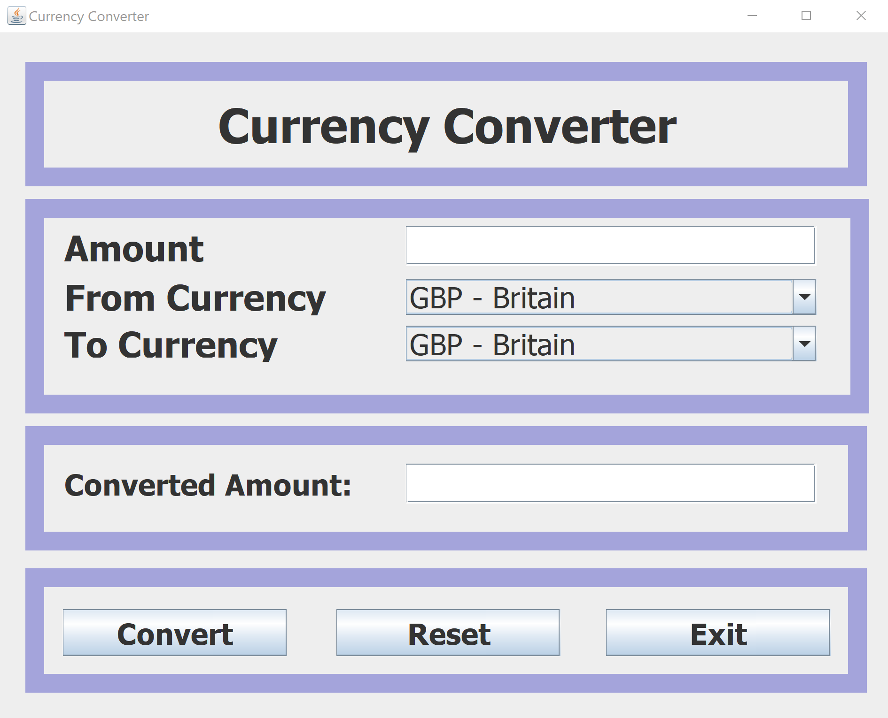

Great! Here's a sample `README.md` for your `Currency_3` Java Swing project, using the uploaded `image.png` from your main folder.

---

### ✅ `README.md` for `Currency_3` (Java Swing Currency Converter)

````markdown
# Currency_3

A simple desktop **Currency Converter** application built with **Java Swing**. It allows users to convert amounts between popular currencies including GBP, USD, EUR, INR, and more.



## 💡 Features

- Clean graphical interface using `JFrame` and `JPanel`
- Converts between:
  - GBP (Britain)
  - USD (United States Dollar)
  - EUR (Euro)
  - INR (Indian Rupee)
  - CAD, AUD, CNY, CHF, NGN, MXN
- Supports amount input, conversion, reset, and exit
- Colorful layout with grouped sections

## 🛠️ Requirements

- Java JDK 17 or newer
- Eclipse IDE or any Java-compatible editor

## 🚀 How to Run

1. Clone this repository:

   ```bash
   git clone https://github.com/yourusername/Currency_3.git
   cd Currency_3
````

2. Open the project in your IDE (e.g., Eclipse or IntelliJ)

3. Run the `Currency_3.java` file

## 📁 Project Structure

```
Currency_3/
├── Currency_3.java        # Main GUI application
├── image.png              # Screenshot used in README
└── README.md              # This file
```

## 📷 Screenshot


## 📄 License

This project is open-source and free to use.

---

Made with ❤️ in Java

```

---

### 📌 Notes:
- Make sure `image.png` is **in the same folder** as your `README.md`.
- When you push to GitHub, GitHub will render the image automatically.

Let me know if you'd like to also add a `.gitignore` or license file.
```
