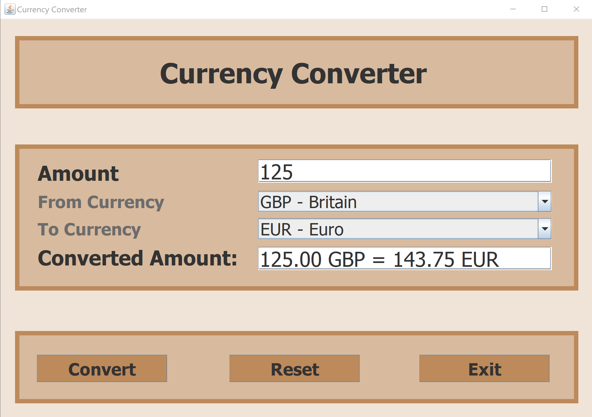

# Java Swing Currency Converter

A simple desktop **Currency Converter** application built with **Java Swing**. It allows users to convert amounts between popular currencies including GBP, USD, EUR, INR, and more.

## 💡 Features

- Clean graphical interface using `JFrame` and `JPanel`
- Converts between:
  - GBP (Britain)
  - USD (United States Dollar)
  - EUR (Euro)
  - INR (Indian Rupee)
  - CAD, AUD, CNY, CHF, NGN, MXN
- Supports amount input, conversion, reset, and exit
- Colorful layout with grouped sections

## 🛠️ Requirements

- Java JDK 17 or newer
- Eclipse IDE or any Java-compatible editor

## 🚀 How to Run

1. Clone this repository:

   ```bash
   git clone https://github.com/yourusername/Currency_3.git
   cd Currency_3
   ```

2. Open the project in your IDE (e.g., Eclipse or IntelliJ)

3. Run the `Currency_3.java` file

## 📁 Project Structure

```
Currency_Converter/
├── src/
│   └── eCurrency_3/
│       └── Currency_3.java
├── README.md
├── image.png
├── .gitignore

```

## 📷 Screenshot




